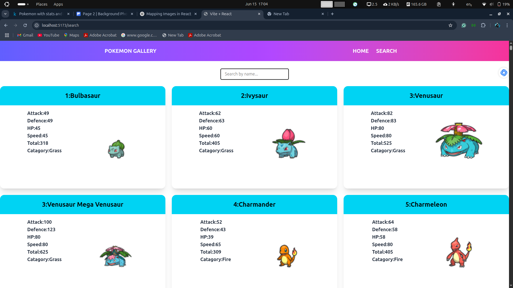

---

## 📘 Pokémon Gallery App

```markdown
# 🧩 Pokémon Gallery App

A responsive Pokémon Gallery built with **React** and **Tailwind CSS**, displaying Pokémon cards with filtering, search functionality, and dynamic data rendering.


 📸 Demo





## 🚀 Features

- 🔍 Search Pokémon by name
- 🎯 Filter by type/category
- 📱 Responsive layout with Tailwind CSS
- 💾 Data sourced from JSON / API
- 🧭 Client-side routing with React Router
- 🌙 Dark mode ready (optional)

---

## 🛠️ Tech Stack

- ⚛️ React.js
- 💨 Tailwind CSS
- 🔁 React Router DOM
- 📦 JSON or REST API (e.g., PokéAPI)

---

## 📁 Folder Structure

```

pokemon-gallery/
├── public/
│   └── images/
├── src/
│   ├── components/
│   │   ├── Navbar.jsx
│   │   ├── PokemonCard.jsx
│   │   ├── SearchBar.jsx
│   │   └── FilterMenu.jsx
│   ├── pages/
│   │   ├── Home.jsx
│   │   └── About.jsx
│   ├── App.jsx
│   └── main.jsx
└── README.md

````

---

## 🧪 Getting Started

### 1. Clone the repo

```bash
git clone https://github.com/AGUNAN/pokemon-gallery.git
cd pokemon-gallery
````

### 2. Install dependencies

```bash
npm install
```

### 3. Start the dev server

```bash
npm run dev
```

> Visit `http://localhost:5173` to view the app

---

## 🐱 Sample Pokémon Data Format (JSON)

```json
[
  {
    "id": 1,
    "name": "Bulbasaur",
    "type": "Grass",
    "image": "/images/bulbasaur.png"
  },
  {
    "id": 4,
    "name": "Charmander",
    "type": "Fire",
    "image": "/images/charmander.png"
  }
]
```

---

## 🧑‍💻 Author

* [AGUNAN](https://github.com/AGUNAN)
* Built with ❤️ using React and TailwindCSS

---

## 📄 License

This project is licensed under the MIT License.

```

---

Let me know if you want:
- A dark mode version
- Markdown for GitHub Pages
- Auto-deploy instructions with Vercel or Netlify

Just say the word!
```
